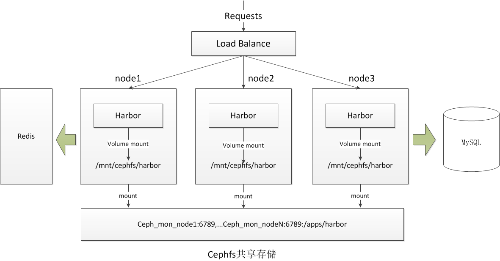
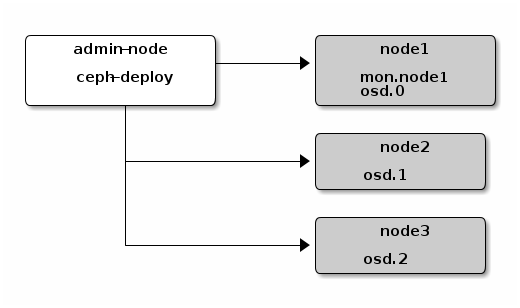

#  Harbor + Ceph 实现高可用
## 通过共享存储实现高可用，需独立部署 Redis(session 共享) 和 MySQL
<br>
<div align="center">
    
    <br>
</div>

## Env
### Hosts
|Hostname|Ip|OS|Resource|
|---|---|---|---|
|prod-ops-harbor-01|192.168.1.251|CentOS 7|2C/4G/20+200GB|
|prod-ops-harbor-02|192.168.1.252|CentOS 7|2C/4G/20+200GB|
|prod-ops-harbor-03|192.168.1.253|CentOS 7|2C/4G/20+200GB|

## Steps

1. Ceph 集群搭建;
2. 所有节点挂载共享存储;
3. 修改 harbor.cfg 配置使用独立的 Redis 和 MySQL;

### Ceph 集群搭建
#### Ceph-deploy Setup¶
1.Install and enable the Extra Packages for Enterprise Linux (EPEL) repository:
```
# yum install -y epel-release
```

2.Add the Ceph repository to your yum configuration file at /etc/yum.repos.d/ceph.repo 
```
# cat << EOM > /etc/yum.repos.d/ceph.repo
[ceph-noarch]
name=Ceph noarch packages
baseurl=https://download.ceph.com/rpm-luminous/el7/noarch
enabled=1
gpgcheck=1
type=rpm-md
gpgkey=https://download.ceph.com/keys/release.asc
EOM
```

3.Update your repository and install ceph-deploy:
```
# yum -y update
# yum -y install ceph-deploy
```

#### Ceph Node Setup¶
* Install NTP

    We recommend installing NTP on Ceph nodes (especially on Ceph Monitor nodes) to prevent issues arising from clock drift. See Clock for details.
On CentOS / RHEL, execute:

```
# yum install -y epel-release
# yum -y install ntp ntpdate ntp-doc
```

* Enable Password-less SSH¶

    Since ceph-deploy will not prompt for a password, you must generate SSH keys on the admin node and distribute the public key to each Ceph node. ceph-deploy will attempt to generate the SSH keys for initial monitors.

1.Generate the SSH keys. Leave the passphrase empty:
```
# ssh-keygen 
```
2.Copy the key to each Ceph Node,    
```
# for i in {01..03};do ssh-copy-id prod-ops-harbor-${i}:;done
```

* Priorities/Preferences¶
```
# yum -y install yum-plugin-priorities
```

#### Storage Cluster Quick Start¶
<br>
<div align="center">
    
    <br>
</div>

* create a directory on your admin node for maintaining the configuration files and keys that ceph-deploy generates for your cluster.
```
# mkdir my-cluster
# cd my-cluster
```

1.Create the cluster.
```
# yum -y install python2-pip
# ceph-deploy new prod-ops-harbor-01
```
2.Install Ceph packages.:
```
# ceph-deploy install prod-ops-harbor-{01..03}
# yum -y install ceph ceph-radosgw --skip-broken  # manually
```
3.Deploy the initial monitor(s) and gather the keys:
```
# ceph-deploy mon create-initial
```
4.Use ceph-deploy to copy the configuration file and admin key to your admin node and your Ceph Nodes so that you can use the ceph CLI without having to specify the monitor address and ceph.client.admin.keyring each time you execute a command.
```
# ceph-deploy admin prod-ops-harbor-{01..03}
```
5.Deploy a manager daemon. (Required only for luminous+ builds):
```
# ceph-deploy mgr create prod-ops-harbor-01
```
6.Add three OSDs. 
```
# ceph-deploy osd create --data /dev/sdb prod-ops-harbor-01
# ceph-deploy osd create --data /dev/sdb prod-ops-harbor-02
# ceph-deploy osd create --data /dev/sdb prod-ops-harbor-03
```

7.Check your cluster’s health.

```
[root@prod-ops-harbor-01 my-cluster]# ceph health
HEALTH_OK
[root@prod-ops-harbor-01 my-cluster]# ceph -s
  cluster:
    id:     687a6ee3-d36f-44fd-9049-debca1e1b60d
    health: HEALTH_OK
 
  services:
    mon: 1 daemons, quorum prod-ops-harbor-01
    mgr: prod-ops-harbor-01(active)
    osd: 9 osds: 3 up, 3 in
 
  data:
    pools:   0 pools, 0 pgs
    objects: 0  objects, 0 B
    usage:   3.0 GiB used, 597 GiB / 600 GiB avail
    pgs:
```

#### Add a Metadata Server¶
To use CephFS, you need at least one metadata server. Execute the following to create a metadata server
```
# ceph-deploy mds create prod-ops-harbor-01
```

#### Adding Monitors¶
A Ceph Storage Cluster requires at least one Ceph Monitor and Ceph Manager to run. For high availability, Ceph Storage Clusters typically run multiple Ceph Monitors so that the failure of a single Ceph Monitor will not bring down the Ceph Storage Cluster. Ceph uses the Paxos algorithm, which requires a majority of monitors (i.e., greather than N/2 where N is the number of monitors) to form a quorum. Odd numbers of monitors tend to be better, although this is not required.

Add two Ceph Monitors to your cluster:
```

```

#### Create  [CephFS:](http://docs.ceph.org.cn/cephfs/)

```
# ceph osd pool create cephfs_data 128
# ceph osd pool create cephfs_metadata 64
# ceph fs new cephfs cephfs_metadata cephfs_data

```

### Client mount cephfs use fatab 
```
# grep key /etc/ceph/ceph.client.admin.keyring  | awk '{print $3}' > /etc/ceph/admin.secret
# for i in {01..03}; do scp /etc/ceph/admin.secret prod-ops-harbor-${i}:/etc/ceph/admin.secret;done
# for i in {01..03}; do ssh prod-ops-harbor-${i} "mkdir -p /mnt/cephfs/";done
# for i in {01..03}; do ssh prod-ops-harbor-${i} "echo '192.168.1.251:6789,192.168.1.252:6789,192.168.1.253:6789:/   /mnt/cephfs ceph name=admin,secretfile=/etc/ceph/admin.secret,noatime,_netdev 0 2' >> /etc/fstab";done  
# for i in {01..03}; do ssh prod-ops-harbor-${i} "mount -a; df -TH| grep ceph";done 
# mkdir -p /mnt/cephfs/harbor
```


