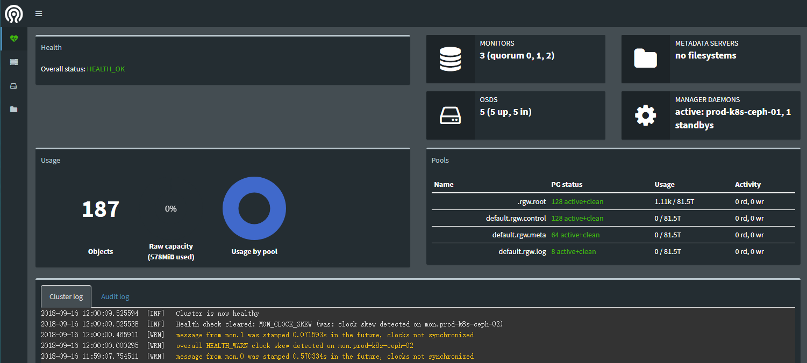
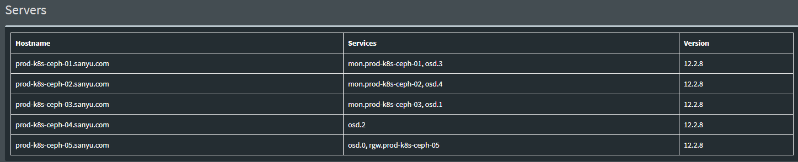

# Ceph RDB

## Env

### Hosts
|Hostname|Ip|OS|Resource|Roles|
|---|---|---|---|---|
|prod-k8s-ceph-01|192.168.1.241|CentOS 7|2C/2G/30+300GB|osd、md、mon、rgw、mgr|
|prod-k8s-ceph-02|192.168.1.242|CentOS 7|2C/2G/30+300GB|osd、md、mon|
|prod-k8s-ceph-03|192.168.1.243|CentOS 7|2C/2G/30+300GB|osd、md、mon|
|prod-k8s-ceph-04|192.168.1.244|CentOS 7|2C/2G/30+300GB|osd、md、rgw|
|prod-k8s-ceph-05|192.168.1.245|CentOS 7|2C/2G/30+300GB|osd、md、rgw|


## [Ansible 安装配置 Ceph ](http://docs.ceph.com/ceph-ansible/master/index.html#ansible-on-rhel-and-centos)
```
# git clone https://github.com/ceph/ceph-ansible.git
# cd ceph-ansible
# pip install -r requirements.txt 
# cp group_vars/all.yml.sample group_vars/all.yml
# sed -i "s@#ceph_origin: dummy@ceph_origin: repository@" group_vars/all.yml
# sed -i "s@#ceph_repository: dummy@ceph_repository: community@" group_vars/all.yml
# sed -i "s@#ceph_stable_release: dummy@ceph_stable_release: luminous@" group_vars/all.yml
# sed -i "s@#public_network: 0.0.0.0/0@public_network: 0.0.0.0/0@" group_vars/all.yml
# sed -i "s@#cluster_network: \"{{ public_network | regex_replace(' ', '') }}\"@cluster_network: \"{{ public_network | regex_replace(' ', '') }}\"@" group_vars/all.yml
# sed -i "s@#monitor_interface: interface@monitor_interface: eth0@" group_vars/all.yml
# sed -i "s@#radosgw_interface: interface@radosgw_interface: eth0@" group_vars/all.yml
# sed -i "s@#osd_mkfs_type: xfs@osd_mkfs_type: xfs@" group_vars/all.yml
```

```
# cp group_vars/osds.yml.sample group_vars/osds.yml
# sed -i "s@#devices:@devices:@" group_vars/osds.yml
# sed -i "s@#  - /dev/sdb@  - /dev/sdb@" group_vars/osds.yml
# sed -i "s@#osd_scenario: dummy@osd_scenario: collocated@" group_vars/osds.yml
```

```
# cat <<EOF > hosts
[mons]
prod-k8s-ceph-[01:03].sanyu.com

[osds]
prod-k8s-ceph-[01:05].sanyu.com

[mds]
prod-k8s-ceph-[01:03].sanyu.com

[rgws]
prod-k8s-ceph-[04:05].sanyu.com

[mgrs]
prod-k8s-ceph-01.sanyu.com
EOF
# for i in {01..05};do ssh-copy-id -i .ssh/id_rsa.pub prod-k8s-ceph-${i}.sanyu.com:;done
# ansible all -i hosts -m ping
# ansible-playbook -i hosts site.yml
INSTALLER STATUS ********************************
Install Ceph Monitor        : Complete (0:09:42)
Install Ceph Manager        : Complete (0:01:45)
Install Ceph OSD            : Complete (0:11:35)
Install Ceph RGW            : Complete (0:00:56)
```

## Result
```
Total PGs = (Total_number_of_OSD * 100) / max_replication_count
# ceph -s
    cluster:
      id:     4356182a-1b65-479f-856b-ccc32ad8990f
      health: HEALTH_OK
   
    services:
      mon: 3 daemons, quorum prod-k8s-ceph-01,prod-k8s-ceph-02,prod-k8s-ceph-03
      mgr: prod-k8s-ceph-01(active), standbys: prod-k8s-ceph-02
      osd: 5 osds: 5 up, 5 in
      rgw: 1 daemon active
   
    data:
      pools:   4 pools, 328 pgs
      objects: 187 objects, 1.09KiB
      usage:   578MiB used, 234TiB / 234TiB avail
      pgs:     328 active+clean
```

## Dashboard
mgr: prod-k8s-ceph-01(active)  config in active mgr
```
# ceph mgr module enable dashboard
# systemctl restart ceph-mgr@prod-k8s-ceph-01
```
Open http://192.168.1.241:7000/

<br>
<div align="center">
    
    <br>
</div>

<br>
<div align="center">
    
    <br>
</div>